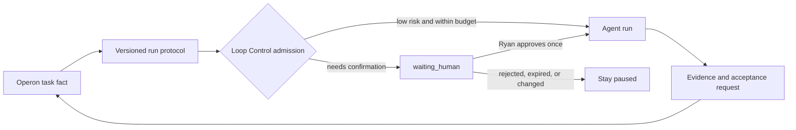

# Operon Pilot Control Plane

Operon is a candidate global task source of truth for Ryan: task, project, dependency, calendar, and board facts remain in Vault Markdown. This controller only decides whether one agent run may start, pause, or resume. It is not coupled to Operon, Taskboard, Codex, Claude, Kimi, or a provider-specific API.

## Human-In-The-Loop

An `approval_request` binds a task ID, `actionHash`, requested action, decision owner, and expiry. A waiting run does not retry. An approved request resumes only the matching action once; a changed action, rejection, expiry, or consumed approval requires a new request. A successful run becomes `ready_for_acceptance`, never automatically done.

## Bounded Automation

The policy template uses conservative defaults: one scan every 20 minutes, one concurrent run, four daily runs, two attempts per task, a 30-minute cooldown, and a 15-minute run limit. Recovery marks stale runs `timed_out` without automatic replay.

Each run reserves `requestedTokens` and declares `contextChars`. `hard` token policy blocks overages; `advisory` policy warns without claiming exact usage. Completion labels telemetry as `exact`, `estimated`, or `unknown`.

The Operon adapter may map this protocol to sealed plans and receipts only after the live Runtime is healthy and the exact task can be reread. During migration, do not double-write Taskboard and Operon.
