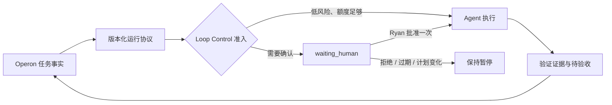

# Operon 试点控制面

Operon 是 Ryan 的全局任务事实源候选：任务、项目、依赖、日历和看板仍在 Markdown/Vault 中；本控制面只决定某次 agent 运行能否开始、暂停或恢复。它不绑定 Operon、Taskboard、Codex、Claude、Kimi 或某个模型的私有 API。



## 人在回路

需要 Ryan 确认时，agent 创建一个 `approval_request`，其中包含任务 ID、`actionHash`、请求动作、决策人和过期时间。控制面将关联运行置为 `waiting_human`，不会轮询重试。

- Ryan 批准后，只有相同任务和相同 `actionHash` 的那一次恢复请求可以继续。
- 批准一经消费即失效；动作内容改变、Ryan 拒绝或审批过期，都必须重新申请。
- 成功运行只会进入 `ready_for_acceptance`，不会自动把 Operon 任务标记为完成。

## 有界自动化

策略模板位于 `templates/loop-control-policy.json`。首轮保守默认：20 分钟检查一次、并发 1、每天最多 4 次、每个任务最多 2 次、冷却 30 分钟、一次最长 15 分钟。

`recover` 只会把心跳或时长超时的运行标成 `timed_out`，**不会自动重放**。同一任务达到次数上限后必须人工检查证据、调整计划或显式创建新的运行。

## 预算规则

每次运行需要在开始前申明 `requestedTokens` 和 `contextChars`。`hard` 模式会阻止超出单次或当日预算的运行；`advisory` 模式会保留警告，但不伪造精确 token 数据。运行结束时必须标注用量的 `exact`、`estimated` 或 `unknown` 测量质量。

这保证不同客户端没有一致 token 遥测时，系统仍有确定的上下文、次数、并发和时长上限。

## 本地试用

```bash
cp templates/loop-control-policy.json /tmp/loop-policy.json
node scripts/ryan-loop-control.js policy validate /tmp/loop-policy.json
node scripts/ryan-loop-control.js run admit /tmp/run.json --policy /tmp/loop-policy.json --state /tmp/loop-state.json
```

只有在 Operon Runtime 健康、任务 ID 能精确重读、且 Ryan 完成试点验收后，adapter 才能把 `run` 协议映射为 Operon 的 sealed plan 和 receipt。迁移期间不双写 Taskboard 与 Operon。
