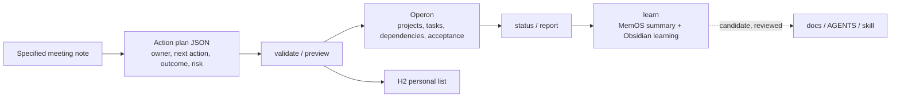

# Meeting-to-Outcome Personal Loop

This optional module turns already-curated meeting actions into an observable, controlled loop. An agent first creates a versioned JSON plan from a meeting note the user explicitly provides; the script then validates, deduplicates, and writes bounded records. It never scans an entire Obsidian vault or infers actions from unrelated notes.

Only actions with `owner: "ryan"` enter the personal loop. Unknown dates stay unknown rather than being fabricated. Operon is the default task backend: it creates one sealed batch preview for same-source actions, applies only that reviewed plan, and rereads each exact task afterward. Taskboard remains available only through the explicit `--backend taskboard` compatibility path. Read the Chinese guide for the command sequence and safety gates: [personal-loop.zh-CN.md](personal-loop.zh-CN.md).
