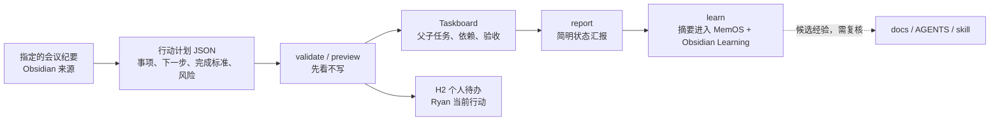

# Meeting-to-Outcome Personal Loop

这个可选模块把已经整理好的会议行动项连成一个可观察的小闭环。它不读取整个 Obsidian，也不替人猜测会议含义；agent 先将会议纪要整理为版本化 JSON，再由脚本负责校验、去重和受控写入。



## 事实源和边界

| 层 | 负责 | 不负责 |
| --- | --- | --- |
| Obsidian | 指定的会议纪要、知识和人工确认后的经验 | 自动扫描整个 vault |
| H2 待办 | Ryan 当前个人行动 | 他人或团队待办 |
| Taskboard | 跨会话生命周期、父子任务、依赖、验收 | 完整会议原文或私密日志 |
| MemOS | 受限摘要、召回和候选经验 | 项目规则、完成事实或系统指令 |
| Git | 代码和验证证据 | 会议决策和任务验收 |

只有 `owner: "ryan"` 的事项可以进入此个人闭环。没有明确截止时间时保留事项并写成“待补截止时间”；脚本绝不虚构时间。

## 使用方式

先由 agent 从你明确提供的会议纪要生成计划。可从模板起步：

```bash
cp templates/meeting-action-plan.json /tmp/meeting-actions.json
node scripts/ryan-personal-loop.js validate /tmp/meeting-actions.json
node scripts/ryan-personal-loop.js preview /tmp/meeting-actions.json --backend operon --preview-file /tmp/operon-preview.json
node scripts/ryan-personal-loop.js h2-preview /tmp/meeting-actions.json
```

确认预览后，分别执行写入动作：

```bash
node scripts/ryan-personal-loop.js apply /tmp/meeting-actions.json --backend operon --preview-file /tmp/operon-preview.json
node scripts/ryan-personal-loop.js h2-apply /tmp/meeting-actions.json --h2-file "/path/to/26年 H2待办.md"
node scripts/ryan-personal-loop.js learn /tmp/meeting-actions.json --vault "/path/to/ObsidianVault"
```

默认后端是 Operon：`preview --backend operon --preview-file /tmp/operon-preview.json` 先生成一个包含全部同源事项的 sealed plan，Ryan 确认后用 `apply --backend operon --preview-file /tmp/operon-preview.json` 应用同一批 `planRef`，再逐条精确回读。Taskboard 仅作为兼容后端，通过显式 `--backend taskboard` 使用。Operon 任务不会写入第二套任务数据库。

`apply` 创建 Operon 任务：低/中风险且 `executor` 是 agent 的事项进入可规划状态；高风险、`waiting_human`、`executor: ryan` 或 `manual` 的事项保持暂停，必须经过 HITL 闸门。预览文件必须与当前行动计划的 ID 列表一致；重复应用只能使用已审核的原始 `planRef`，不得重新预览或盲目重试；适配器会在应用后用返回的 `operonId` 精确回读。

```bash
node scripts/ryan-personal-loop.js status --parent TASK_ID
node scripts/ryan-personal-loop.js report --parent TASK_ID
```

`report` 只会添加状态摘要评论，不会把任务直接标成 `done`。`done` 始终需要 Ryan 明确验收。

## 自动化边界

- 会议语义提炼是 agent 的判断，脚本只处理稳定协议。
- 自动执行只针对低/中风险、范围明确、可恢复的 `todo` 子任务。
- 发送、发布、删除、授权、付款、部署和不可逆操作必须等待 Ryan 的明确批准。
- `learn` 向 MemOS 写入的只有摘要、证据、标签和置信度，不上传会议原文；MemOS 不可用时沿用本地 memory adapter 降级。
- Obsidian 写入默认是 Learning 笔记；H2 写入必须显式传入目标文件。

这让 Taskboard 管“是否完成并验收”，Codex 等 agent 管“如何推进与验证”，MemOS 管“下次能否更快回想经验”，而 Ryan 始终保有改变计划和最终验收的控制权。
