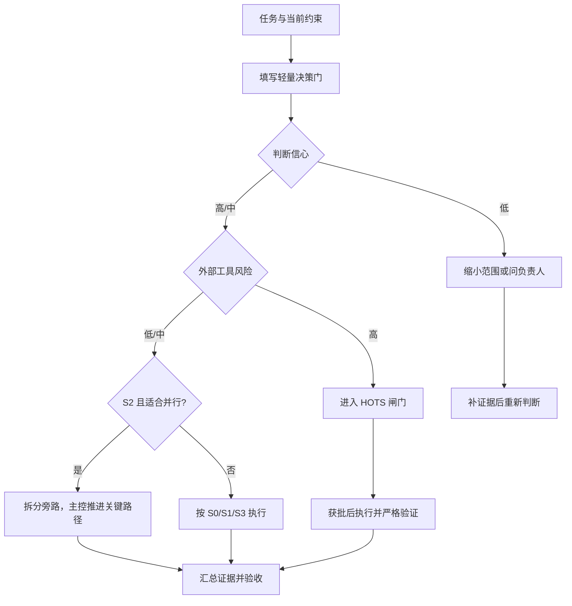

# 结构化决策门

结构化决策门是一种轻量的任务路由方法，受 Jev / System One 一类“把语义判断变成小型结构化输出”的思路启发。

它不是新的 agent 编排系统，也不要求安装 Jev、调用外部 API 或引入额外服务。目标是让 agent 在执行前用少量字段说清楚：**怎么做、信心多高、是否适合并行、怎么验证、何时需要人决定**。

## 什么时候使用

S0 小任务不需要填写。以下情况可以在执行前复制 `templates/decision-gate.zh-CN.md`，或直接在任务卡中补充决策门：

- S1 以上任务，且存在误判或返工风险；
- 任务可能拆给多个 agent 或外部工具；
- 任务涉及发布、权限、数据、隐私或不可逆动作；
- 任务范围容易漂移，或完成标准不够清楚。

## 六个字段

| 字段 | 可选值 | 作用 |
| --- | --- | --- |
| 任务路由 | S0 直接做 / S1 先想清 / S2 并行拆分 / S3 计划任务卡 | 选择最小的合理工作模式 |
| 判断信心 | 高 / 中 / 低 | 表示对路由和假设的把握，不是正确率保证 |
| 是否适合并行 | 是 / 否 | 判断是否有独立、低冲突的旁路任务 |
| 外部工具风险 | 低 / 中 / 高 | 判断浏览器、MCP、CLI、第三方 API 或外部 agent 的披露和写入风险 |
| 验证强度 | 轻量 / 常规 / 严格 | 预先约定完成证明的力度 |
| 是否先问 Ryan | 是 / 否 | 标记需要人作决定、授权或取舍的情况 |

## 决策门规则

1. **低信心**：先缩小范围、补充证据或询问负责人，不要猜着推进。
2. **高外部工具风险**：进入 HOTS 闸门，说明最小披露范围、动作影响和恢复方案。
3. **S2 且适合并行**：主控保留关键路径，把旁路拆成有明确文件范围和停止条件的任务卡。
4. **严格验证**：在执行前写出验收证据、回滚或恢复路径。
5. **普通不确定性不等于等待人**：只有存在具体决策、负责人和影响时，才使用 `waiting_for_human`。

## 与 Jev / TypeSafe 的关系

如果项目以后接入 Jev 或其他结构化判断服务，可以把这些字段映射为 Choice、Score、Noul 等问题类型。但 **Ryan Agent Work Kit 不依赖任何特定供应商**：

- 规则和阈值仍由代码、项目文档和负责人控制；
- 模型输出只提供建议，不能绕过 Git、安全或 HOTS 闸门；
- 涉及源码、日志、客户数据、密钥或内部计划时，先做最小披露；
- 低置信度应触发人工确认或缩小范围，而不是自动重试。

## 复盘

任务结束时，只在它确实影响了范围、委托、验证或风险判断时记录结果。不要为了“填完整”而给每个 S0 任务增加表单负担。
