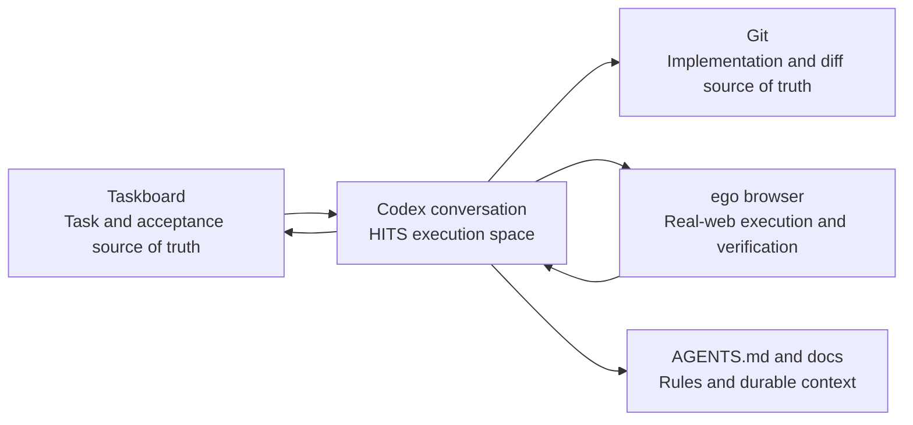
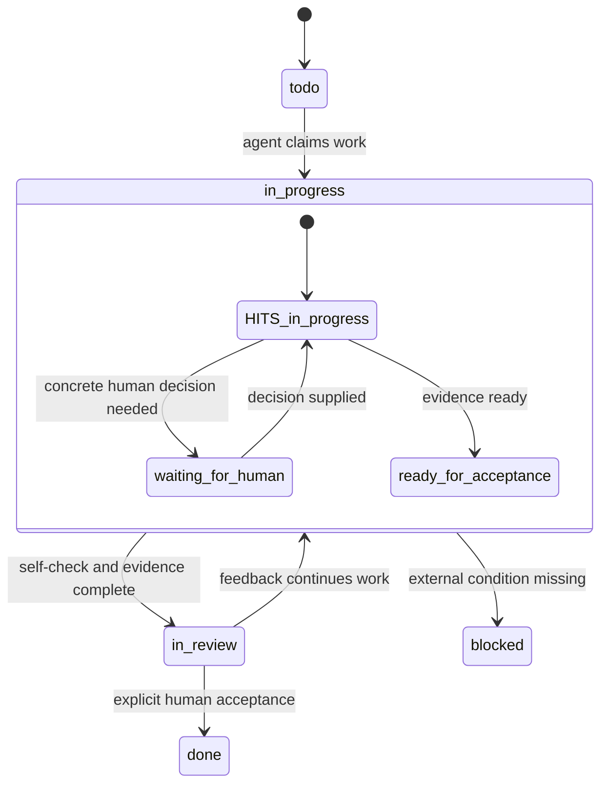

# Taskboard, Codex, And ego browser

These tools solve different problems. They should not replace one another or introduce runtime dependencies on one another.



## Ownership

| Layer | Owns | Does not own |
| --- | --- | --- |
| Taskboard | Cross-session tasks, priority, acceptance, blockers, delivery summary | Step-by-step commands, full chats, private logs, or login state |
| Codex conversation | Scope alignment, implementation, HITS collaboration, validation, handoff | Project rules or durable task history |
| ego browser | Isolated browser actions, screenshots, and smoke checks requiring real web state | Ordinary web research or task management |
| Git | Source, diffs, branches, and reviewable implementation | Product requirements, acceptance conclusions, or human decisions |
| `AGENTS.md` and `docs/` | Project rules, stable contracts, durable context | Temporary progress for every run |

## When To Create A Taskboard Task

Use Taskboard only for work worth persisting: cross-session features, bugs, research, or acceptance items; work needing human confirmation; work involving multiple agents or external tools; and requirements likely to cause rework.

Do not create tasks for one-line answers, temporary commands, ordinary chat, or fragments without acceptance value. Search before creating a task, and keep one task focused on one verifiable outcome.

Keep its description to five lines:

```text
Goal: the outcome to achieve
Scope: what may change / must not change
Acceptance: how completion is judged
Risk: forbidden actions or sensitive boundaries
Notes: links, screenshots, or necessary context
```

## Two State Models, Not One

Taskboard owns middle/outer-loop lifecycle states: `backlog`, `todo`, `in_progress`, `in_review`, `done`, `blocked`, and `canceled`.

HITS owns execution states in a Codex conversation or Task Card: `in_progress`, `waiting_for_human`, `recommend_agent_switch`, `ready_for_acceptance`, and `stopped`.

They do not map one-to-one. For example, while a web login needs human action, the Taskboard task can remain `in_progress` while the affected lane becomes `waiting_for_human`. After self-check, the board moves to `in_review` and the Task Card can say `ready_for_acceptance`. Move a Taskboard task to `done` only after the named human explicitly accepts it.



## ego browser Boundaries

Use ego browser only when real web state matters, such as logged-in page checks, form interaction, button smoke tests, screenshots, or visual reproduction. Use ordinary browsing for regular web information.

Use one isolated task space per goal. Prefer semantic interaction; for Figma, Notion, document, and canvas-like editors, start with screenshots and a small write probe. Login, MFA, payments, authorization, deletion, publishing, and irreversible submissions require a HOTS gate: pause the affected lane and let the named decision owner complete or explicitly approve the action. Never put login state, cookies, private page contents, or full browser transcripts into Taskboard.

## Minimal Loop

1. Create or claim the Taskboard task with a clear goal, scope, acceptance, and risk.
2. Codex works in one HITS lane; derive a detailed Task Card only for S2/S3 work.
3. Use ego browser for isolated validation when real web evidence is necessary.
4. Write a concise summary of changes, verification, risk, and evidence references to Taskboard, then move it to `in_review`.
5. Move it to `done` only after explicit human acceptance. Put reusable learning into `AGENTS.md`, project docs, templates, or skills.

Taskboard comments should contain delivery summaries and evidence references, never private logs, chats, authentication data, or sensitive web content.
