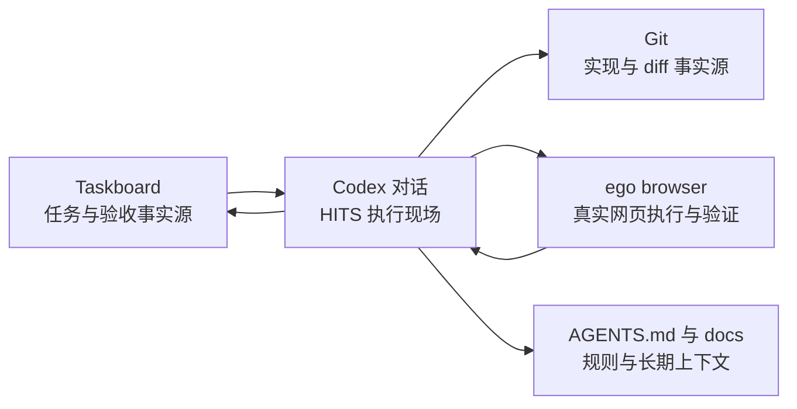
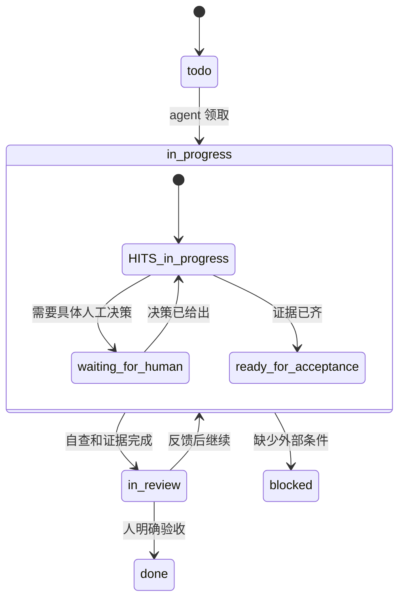

# Taskboard、Codex 与 ego browser

这三个工具解决不同问题，不应互相替代，也不应引入彼此的运行时依赖。



## 各自负责什么

| 层 | 负责 | 不负责 |
| --- | --- | --- |
| Taskboard | 跨会话任务、优先级、验收、阻塞和交付摘要 | 逐步命令、完整会话、私密日志或登录态 |
| Codex 对话 | 范围澄清、实现、HITS 协作、验证和交接 | 取代项目规则或长期任务记录 |
| ego browser | 有真实网页状态时的隔离浏览器操作、截图和冒烟验证 | 普通网页资料检索或任务管理 |
| Git | 源码、diff、分支和可复核实现 | 产品需求、验收结论或人类决策 |
| `AGENTS.md` 与 `docs/` | 项目规则、稳定契约和长期上下文 | 每次执行的临时进度 |

## 什么时候创建 Taskboard 任务

只把值得持久化的工作放进 Taskboard：跨会话功能、缺陷、研究、验收项；需要人工确认；多 agent 或外部工具参与；或容易返工的需求。

一句话能处理的问题、临时命令、纯聊天和没有验收价值的碎片不建任务。创建前先查重；一条任务只描述一个可验收结果。

描述保持五行以内：

```text
目标：要达成什么结果
范围：允许改哪里 / 不碰哪里
验收：如何判断完成
风险：不能做的动作或敏感边界
补充：链接、截图或必要上下文
```

## 两套状态，不要混用

Taskboard 是中环/外环的生命周期状态：`backlog`、`todo`、`in_progress`、`in_review`、`done`、`blocked`、`canceled`。

HITS 是 Codex 对话和任务卡中的执行状态：`in_progress`、`waiting_for_human`、`recommend_agent_switch`、`ready_for_acceptance`、`stopped`。

它们不一一映射。例如网页登录等待时，Taskboard 可以仍是 `in_progress`，而受影响 lane 标为 `waiting_for_human`；agent 自查完成后，看板进入 `in_review`，任务卡可写 `ready_for_acceptance`。只有指定的人明确验收后才把 Taskboard 移到 `done`。



## 使用 ego browser 的边界

只在需要真实网页状态时使用 ego browser，例如登录后的页面检查、表单操作、按钮冒烟验证、截图或复现视觉问题。普通网页信息优先用常规浏览能力。

每个目标使用隔离 task space。优先语义操作；Figma、Notion、文档或 Canvas 类复杂编辑器先用截图和小范围探针验证。登录、验证码、付款、授权、删除、发布和不可逆提交进入 HOTS 闸门：暂停受影响 lane，交给指定决策人完成或明确批准后再继续。不要把登录态、Cookie、私密页面内容或完整会话写回 Taskboard。

## 最小闭环

1. 创建或领取 Taskboard 任务，写清目标、范围、验收和风险。
2. Codex 在一个 HITS lane 内推进；S2/S3 再从任务派生详细 Task Card。
3. 需要真实网页证据时，使用 ego browser 做隔离验证。
4. 将改动、验证、风险和证据引用简短写回 Taskboard，移到 `in_review`。
5. 人明确验收后，才移到 `done`；可复用经验再写入 `AGENTS.md`、项目 docs、模板或 skill。

Taskboard 评论只写交付摘要和证据引用，不复制私密日志、会话、认证信息或敏感网页内容。

## 需要生成图片时

图片生成是一个独立的可选执行 lane，不改变 Taskboard、Git 或项目文档的职责。先判断是否能用 Mermaid 或现有素材解决；确实需要图片时，创建清晰的资产目标，再让 `ryan-visual-asset-workflow` 通过 ego 隔离空间生成。Taskboard 只记录资产用途、状态、选定文件和验证证据，不记录完整提示词、网页内容、Cookie 或登录态。默认一轮生成加一轮精修，达到预算或遇到登录、权限、付费、上传、发布等情况就暂停等待 Ryan。
