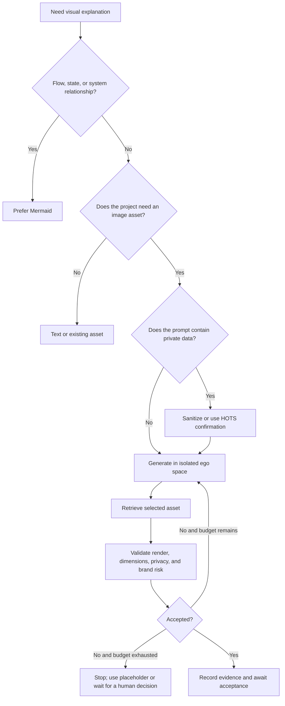

# Visual Asset Workflow

This is an optional visual-asset lane. When a project genuinely needs an image, use an isolated `ego browser` task space to reuse the signed-in ChatGPT web experience, retrieve the selected result, and validate it in the target project. It does not replace Mermaid and does not make ChatGPT web a runtime dependency.

## Decision

## Guardrails

- Prefer Mermaid for ordinary process, sequence, state, and system-relationship explanations.
- Trigger `ryan-visual-asset-workflow` only when a real image asset is needed.
- Use one isolated ego task space per goal and do not operate the user's ordinary browser tab.
- Put only necessary, sanitized context in the prompt. Never send meeting originals, customer data, internal screenshots, source code, credentials, or unreleased plans by default.
- Submit one generation request and, by default, at most one precise refinement: two attempts total. Do not refresh or re-prompt without a bound.
- Login, CAPTCHA, permission, payment, upload, publishing, or irreversible replacement requires a HOTS handoff or explicit approval.
- Render the result in the target project and check dimensions, crop, readability, transparency, file size, privacy, and brand risk.
- Taskboard may contain the asset purpose, status, evidence link, and risks, but never cookies, login state, full browser transcripts, or sensitive prompts.

## Integration

The lane only owns generation and validation. Project rules, Git, Taskboard, Obsidian, MemOS, and publishing remain governed by their existing contracts and adapters.
