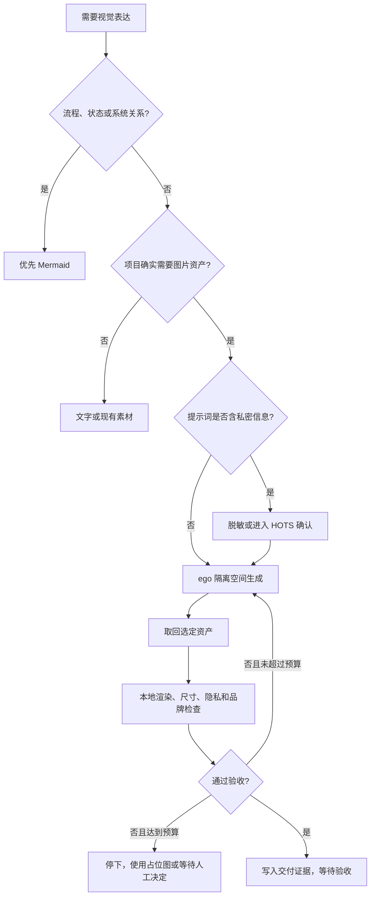
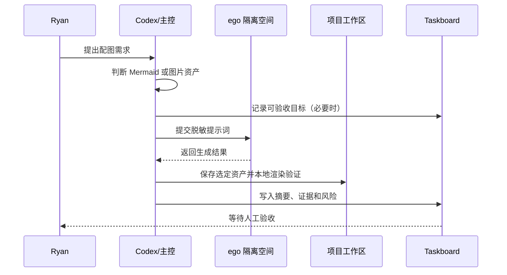

# 视觉资产工作流

这是一条可选的视觉资产通道：当项目确实需要配图时，通过 `ego browser` 的隔离 task space 复用已登录的 ChatGPT 网页，生成图片后取回到项目，再做本地渲染和人工验收。它不替代 Mermaid，也不把 ChatGPT 网页变成运行时硬依赖。

## 先判断是否需要图片

## 使用边界

- 普通流程图、时序图、状态图和系统关系优先使用 Mermaid。
- 只有需要真实图片资产时，才触发 `ryan-visual-asset-workflow`。
- 每个目标使用独立 ego task space；不操作 Ryan 的普通浏览器标签页。
- 提示词只放必要且已脱敏的内容，不上传会议原文、客户资料、内部截图、源码、密钥或未发布计划。
- 新对话只发一次生成请求，默认最多一次精确修订，共两次尝试；不无限刷新或反复换词。
- 生成、下载或导出遇到登录、验证码、权限、付费、上传、发布或不可逆替换时，暂停并进入 HOTS，由 Ryan 接管或明确批准。
- 生成后必须在目标项目中真实渲染检查：尺寸、裁切、可读性、透明背景、文件大小、隐私和品牌风险。
- Taskboard 只记录资产用途、状态、证据链接和风险，不记录 Cookie、登录态、完整网页会话或私密提示词。

## 与现有工作流的关系

这条通道只负责“生成和验证资产”。项目规则、Git、Taskboard、Obsidian、MemOS 和发布流程继续由原有契约负责，适配器之间保持解耦。
