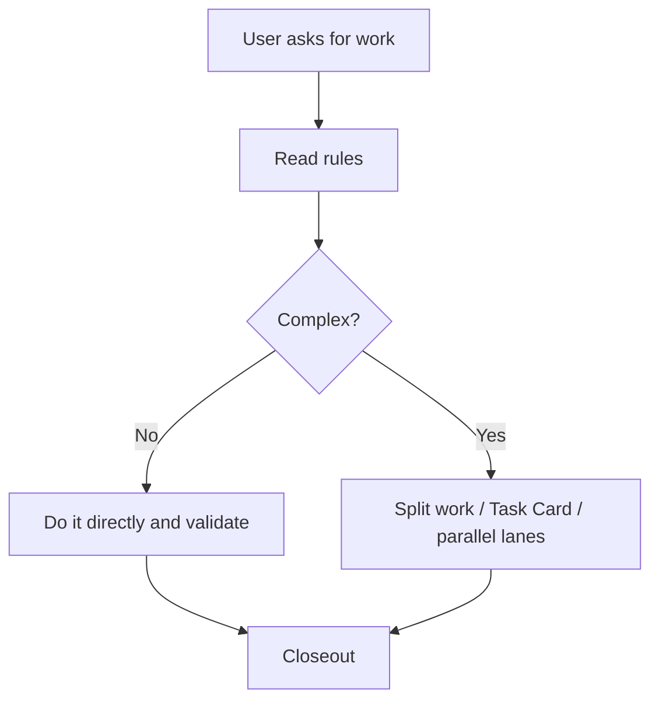

# Visual Explanation Rules

Ryan Agent Work Kit encourages agents to use visual explanations when describing workflows, branching logic, task orchestration, state transitions, or system relationships.

The goal is not to make every answer heavier. The goal is to make complex relationships easier to understand.

## When To Use Mermaid

Prefer a Mermaid diagram when the answer includes:

- Process steps, such as init, handoff, release, or retrospective.
- Branching decisions, such as S0/S1/S2/S3 routing.
- Multi-agent collaboration, such as lead agent, helper agents, external CLI, and acceptance.
- State transitions, such as todo, validation, and learning capture.
- System relationships, such as personal preferences, project rules, Obsidian, and skills.

Default diagram types:

```text
Process / decision: flowchart
Sequence / collaboration: sequenceDiagram
State transitions: stateDiagram-v2
Module relationships: graph
```

## When Not To Use It

Do not add a diagram just for ceremony. Use plain text when:

- The issue fits in one sentence.
- The answer is a simple command, path, or error explanation.
- Mermaid would be harder to read than text.
- The user explicitly asks for only the conclusion.

## When To Use Stronger Visual Tools

Mermaid is good for logic and relationships. It is not ideal for visual detail.

Suggest visual sketches, screenshots, HTML mockups, Hyperframes, or similar tools when the task involves:

- UI layout, page structure, or interaction flow.
- Demo material, screen recording scripts, or product storytelling.
- Visual comparison between options.
- Public-facing explanations that should be understood at a glance.

## Response Pattern

When explaining a workflow, use:

````markdown
My understanding:



Conclusion: ...
````

## Ryan Preference

- When an answer contains workflow logic, prefer Mermaid.
- Mermaid should improve understanding, not add decoration.
- If a diagram grows beyond 12 nodes, split it into two diagrams or summarize first.
- For complex visual or demo needs, suggest Hyperframes, HTML mockups, screenshots, or screen recordings.
- Keep small tasks lightweight; this rule should not add unnecessary process.
