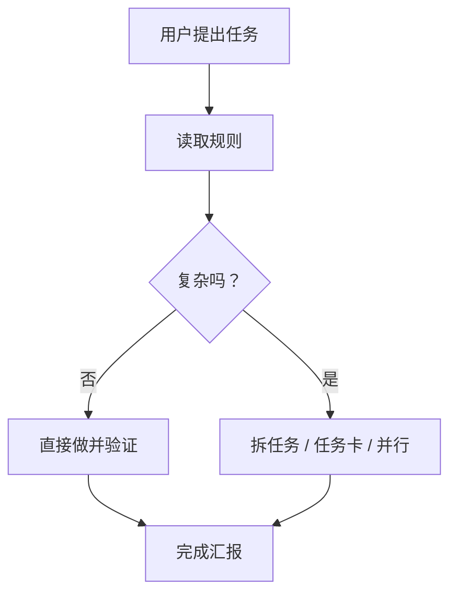

# 可视化解释规则

Ryan Agent Work Kit 鼓励 agent 在解释流程、分支、任务编排、状态流转或系统关系时，优先使用可视化表达。

目标不是让每个回答都变复杂，而是让复杂关系更容易看懂。

## 什么时候用 Mermaid

当回答里出现这些内容时，优先加一个 Mermaid 图：

- 流程步骤，例如初始化、交接、发布、复盘。
- 分支判断，例如 S0/S1/S2/S3 路由。
- 多 agent 协作，例如主控、子 agent、外部 CLI、验收。
- 状态流转，例如任务从待办到验证再到沉淀。
- 系统关系，例如个人偏好、项目规则、Obsidian、skills 的关系。

默认图类型：

```text
流程/判断：flowchart
时序/协作：sequenceDiagram
状态流转：stateDiagram-v2
模块关系：graph
```

## 什么时候不用

不要为了形式感强行画图。以下情况直接文字说明：

- 一句话能说清的小问题。
- 简单命令、路径、报错解释。
- Mermaid 会比文字更难懂。
- 用户明确要求只要结论。

## 什么时候用更强的视觉工具

Mermaid 适合表达逻辑关系，不适合表达视觉细节。

这些情况可以建议使用可视化草图、截图、HTML mockup、Hyperframes 或类似工具：

- UI 布局、页面结构、交互流程。
- 演示材料、录屏脚本、产品故事线。
- 多方案视觉对比。
- 需要让用户“看一眼就懂”的公开展示内容。

## 回答模板

当需要解释流程时，可以使用：

````markdown
我的理解：



结论：...
````

## Ryan 偏好

- 有流程类内容时，优先 Mermaid。
- Mermaid 要服务理解，不要堆节点。
- 如果图超过 12 个节点，先拆成 2 张图或先给摘要。
- 复杂视觉/演示需求再推荐 Hyperframes、HTML mockup、截图或录屏。
- 小任务保持轻，不因为这个规则增加不必要流程。

## 真实图片资产

如果目标不是解释流程，而是项目真的需要插图、封面、背景或其他 bitmap 资产，按需使用 [`ryan-visual-asset-workflow`](../recommended-skills/ryan-visual-asset-workflow/SKILL.md)。它通过 ego 的隔离 task space 访问已登录的 ChatGPT 网页，生成后必须取回到项目中做真实渲染验证；不得把 ChatGPT 网页、登录态或无限重试变成项目运行时依赖。
